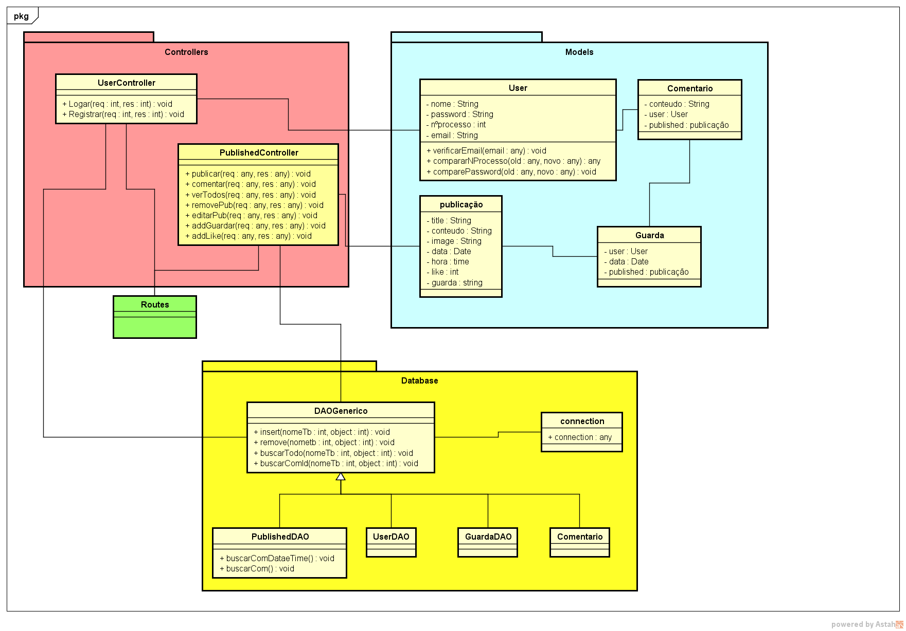

<h1 align="center">UniSocial - Backend</h1>

<div align="center">
  
</div>

## Descrisão
___

>Este é um projeto que visa ajudar a Unibelas a comunicar com os seus estudantes sabendo sobre o que eles pensam sobre determinados fatores, a informar os estudantes sobre os assuntos da instituição, dar voz aos estudantes em assuntos.

<h4 align="center"> 
	🚧  O UniSocial 🚀 Em construção...  🚧
</h4>

## Tabela de sumários

<!--ts-->
   * [Descrisão](#descrisão)
   * [Tabela de sumários](#tabela-de-sumarios)
   * [Funcionalidades](#Funcionalidades)
   * [Pré-requisitos para usar o project](#Pré-requisitos)
   * [Passa para Instalação](#instalacao)
   * [Tecnologias](#tecnologias)
   * [Norma de como trabalhar](#norma)
   * [contribuidores](#contribuidores)
<!--te-->

## Funcionalidades
  ### Módulos ads:
    [] Publicar ads(tanto os alunos, como a inst)
    [] Exibir ads(recents, antigas)
    [] signup (alunos)
    [] login (alunos)
    [] comentar em ads
    [] curtir em ads
    [] pesquisar ads

## Pré-requisitos usar
---

> Antes de começar, você vai precisar ter instalado em sua máquina a seguinte ferramenta que é o 
> [Git](https://git-scm.com). Além disto é bom ter um editor para trabalhar com o código como [VSCode](https://code.visualstudio.com/), [node](https://nodejs.org/en/) para rodar o javascript na máquina, a extensão do vscode [ESLint]() para mostrar error de sintaxe, a extensão [prettier]() para facilitar em ler e escrever regra do pretttier,a [EditorConfig] para manter padrão independentemente do editor de codigo,e a [yarn](https://yarnpkg.com/) para gerenciamento dos pacotes.  


## Passo para instalação
___

```bash
# Clone este repositório
$ git clone <https://github.com/franciscojoaopedro/uni-social-backend.git>

# Acesse a pasta do projeto no terminal/cmd
$ cd uni-social-backend

# Instale as dependências
$ npm install

# Execute a aplicação em modo de desenvolvimento
$ npm start

# O servidor inciará na porta:3333 - acesse <http://localhost:3333>
```

## 🛠 Tecnologias
---

> As seguintes ferramentas foram usadas na construção do projeto:

- [node js](https://pt-br.reactjs.org/)
- [nodemon](https://code.visualstudio.com/)
- [cors](https://git-scm.com)
- [express](https://react-icons.github.io/react-icons/)
- [pritter](https://prettier.io/)
- [eslint](https://eslint.org/)
- [editorConfig](https://editorconfig.org/)
- [husky](https://github.com/typicode/husky)
- [lint-staged](https://github.com/okonet/lint-staged)

## Norma de como trabalhar no Projeto
___

<ol>
  <li>Trabalhar só nos sábados e domingos horário a sua escolha.</li>
  <li>Relatar sobre as alterações feitas no projeto no grupo do facebook ou whatsapp.</li>
  <li>Documentar código verboso.</li>
  <li>Escrever o código em português assim como os commits.</li>
  <li>Refactor código que achas que deverias fazer melhor antes de lançar no github.</li>
  <li>Qualquer erro que está dando, tenta primeiro solucionar antes, se não conseguir comunica sobre o erro.</li>
  <li>
    Criar sempre uma branch quando se trabalha numa funcionalidade ou interface.
      
      ex: 
        Antes de desenvolver:
          git branch feat/login - criar uma branch
          git checkout feat/login - ativar para começar

        Depois desenvolver tudo:
          git checkout main - ativar o main
          git merge feat/login - junta todos os feitos da branch feat/login ao main.
          git branch feat/login -D - deletar a branch.  
  </li>
  <li>
    Ao fazer um git push deve-se fazer sempre isto.
    
    ex:
      git pull - para baixar novas alterações.
      git push ou git push origin main - casos não ouver conflitos 
  </li>
</ol>

## Contribuidores
___

<div style="display: flex; align-items: center; gap: 6px 12px; margin-top: 24px;">
   
  <span style="font-size: 1.5rem;">Ngunga dev </span>
  <a href="https://github.com/franciscojoaopedro">
    
  </a>
   
  <span style="display: flex; align-items: center; font-size: 1.3rem; margin-left: 6px;">
    : franciscojoaopedro1998@gmail.com
  </span>
</div>

<div style="display: flex; align-items: center; gap: 6px 12px; margin-top: 24px;">
   
  <span style="font-size: 1.5rem;">Walany Costa</span>
  <a href="https://github.com/Walany Costa">
    
  </a>
  
  <span style="display: flex; align-items: center; font-size: 1.3rem; margin-left: 6px;">
      : walanycosta@outlook.com
  </span>
</div>
